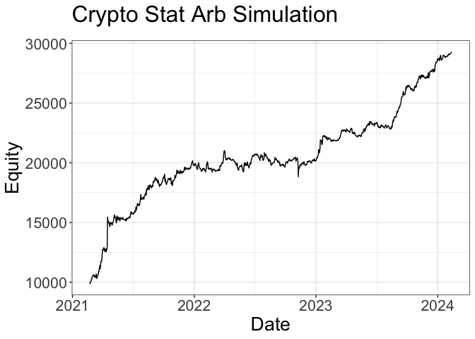
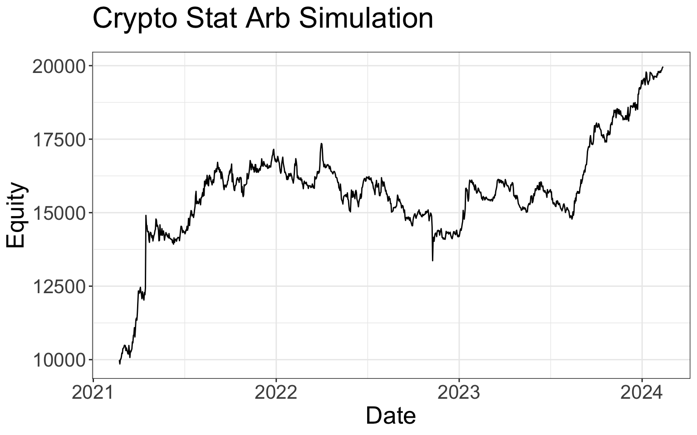
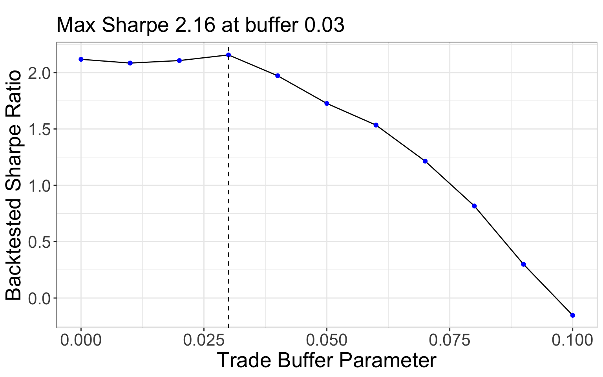
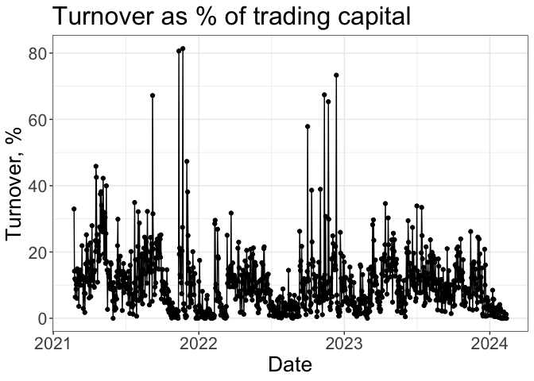
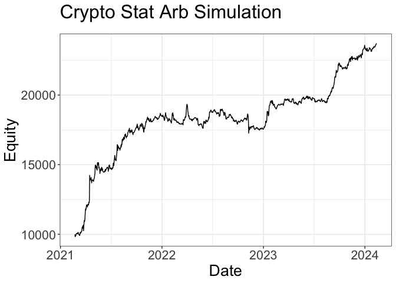
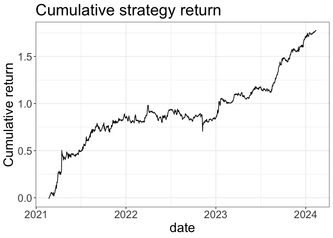
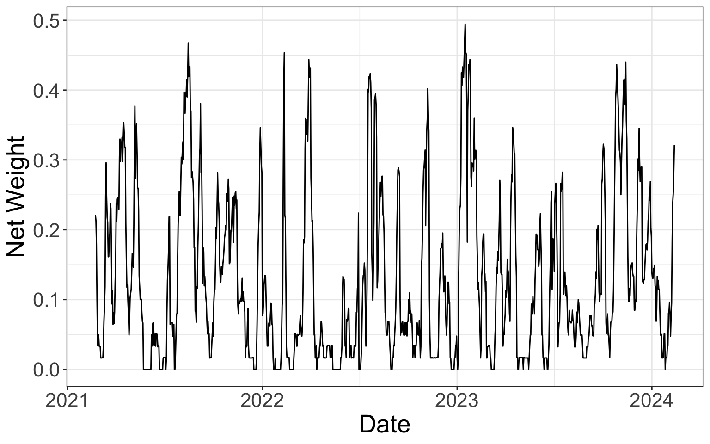
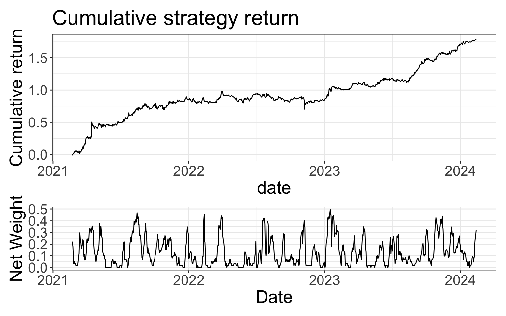

# pipeline for robotweath.com post


<!-- README.md is generated from README.qmd. Please edit that file -->
<!---
  enclose ALL chunks with {webr-r} - not {r}
  then play each in webpage sequentially
  else {r} runs locally only
  ~/Documents_GitHub/ibrokers/vignettes/webr_dag_golem_owl.qmd
--->

# robotwealth.com

<!-- badges: start -->
<!-- badges: end -->

The goal of robotwealth.com is build a `{targets}` pipeline of a blog
post from robotwealth.com.

- \[https://robotwealth.com/how-to-model-features-as-expected-returns/\]

# expected return models

./R/robotwealth.com/expected_returns_models.R

- features ~ expected returns
  - objective
    - predict then capitalise on future returns
  - intuitive optimisation and implementation
  - direct comparison of features
  - framework to add/eval old/new signals
- common *risk* models
  - e.g. covariance estimates
- expected return & risk models
  - direct comparison with trading costs
  - optimisation techniques to trade-off
    - return, risk, and turnover given constraints

## Installation

Install the development version of robotwealth.com from
[GitHub](https://github.com/) with:

``` r
# install.packages("devtools")
devtools::install_github("JohnGavin/robotwealth.com")
```

## Project structure

### Tree structure

    #> .
    #> ├── DESCRIPTION
    #> ├── LICENSE
    #> ├── NAMESPACE
    #> ├── R
    #> │   ├── calc_sharpe.R
    #> │   ├── data.R
    #> │   ├── get_symbols_stables_llama.R
    #> │   ├── ggplot_equity_curve.R
    #> │   ├── globalVariables.R
    #> │   ├── robotwealth.com-package.R
    #> │   ├── scripts
    #> │   │   ├── convex-optimisation-with-cvxr.R
    #> │   │   ├── expected_returns_models.R
    #> │   │   ├── quarto_in_r_script.R
    #> │   │   └── turnover_costs.R
    #> │   ├── tar_config_set_project.R
    #> │   ├── tar_plans
    #> │   │   ├── plan__preamble.R
    #> │   │   └── robotwealth.com
    #> │   │       ├── tar_01_data.R
    #> │   │       ├── tar_02_universe.R
    #> │   │       ├── tar_03_features.R
    #> │   │       ├── tar_04_features_deciles.R
    #> │   │       ├── tar_05_tidymodels.R
    #> │   │       └── tar_06_feat_evol.R
    #> │   └── utils-pipe.R
    #> ├── README.pdf
    #> ├── README.qmd
    #> ├── README.rmarkdown
    #> ├── README.typ
    #> ├── _extensions
    #> │   └── coatless
    #> │       └── webr
    #> │           ├── _extension.yml
    #> │           ├── qwebr-cell-elements.js
    #> │           ├── qwebr-cell-initialization.js
    #> │           ├── qwebr-compute-engine.js
    #> │           ├── qwebr-document-engine-initialization.js
    #> │           ├── qwebr-document-settings.js
    #> │           ├── qwebr-document-status.js
    #> │           ├── qwebr-monaco-editor-element.js
    #> │           ├── qwebr-styling.css
    #> │           ├── template.qmd
    #> │           ├── webr-serviceworker.js
    #> │           ├── webr-worker.js
    #> │           └── webr.lua
    #> ├── _quarto.yml
    #> ├── _targets.yaml
    #> ├── check.env
    #> ├── data
    #> │   ├── perps_2301_2402.rda
    #> │   └── stablecoins.rda
    #> ├── data-raw
    #> │   └── DATASET.R
    #> ├── default.nix
    #> ├── exp_ret_mdl.R
    #> ├── exp_ret_mdl.yaml
    #> ├── exp_ret_mdl_store
    #> │   └── user
    #> ├── man
    #> │   ├── calc_sharpe.Rd
    #> │   ├── get_symbols_stables_llama.Rd
    #> │   ├── ggplot_equity_curve.Rd
    #> │   ├── perps_2301_2402.Rd
    #> │   ├── pipe.Rd
    #> │   ├── robotwealth.com-package.Rd
    #> │   ├── stablecoins.Rd
    #> │   └── tar_config_set_project.Rd
    #> ├── robotwealth.com.Rproj
    #> ├── run.R
    #> ├── run.sh
    #> └── sub_shell
    #>     └── default.nix

### File sizes

    #> # A tibble: 73 × 3
    #>    path                                                     size modify_date
    #>    <fs::path>                                        <fs::bytes> <date>     
    #>  1 data/perps_2301_2402.rda                                2.98M 2024-02-28 
    #>  2 README.pdf                                            287.49K 2024-03-01 
    #>  3 _extensions/coatless/webr/webr.lua                     19.64K 2024-03-01 
    #>  4 README.typ                                             15.84K 2024-03-01 
    #>  5 R/scripts/turnover_costs.R                              14.9K 2024-02-26 
    #>  6 R/tar_plans/robotwealth.com/tar_06_feat_evol.R          9.54K 2024-02-26 
    #>  7 _extensions/coatless/webr/qwebr-compute-engine.js       9.44K 2024-03-01 
    #>  8 R/tar_plans/plan__preamble.R                            8.97K 2024-02-23 
    #>  9 _extensions/coatless/webr/qwebr-cell-elements.js         8.7K 2024-03-01 
    #> 10 R/scripts/expected_returns_models.R                     8.66K 2024-02-27 
    #> # ℹ 63 more rows

## Pipeline example

### `targets::tar_make`

    #> ✔ skipped target rolling_days_since_high_20
    #> ✔ skipped target aprms
    #> ▶ dispatched target url_stables_llama_files
    #> ● completed target url_stables_llama_files [0.001 seconds]
    #> ▶ dispatched target url_csv_files
    #> ● completed target url_csv_files [0 seconds]
    #> ✔ skipped target gg_stepwise1
    #> ▶ dispatched branch url_stables_llama_6411c91e
    #> ● completed branch url_stables_llama_6411c91e [0 seconds]
    #> ● completed pattern url_stables_llama
    #> ✔ skipped branch url_csv_db06cf58
    #> ✔ skipped pattern url_csv
    #> ▶ dispatched branch stables_llama_lst_61b26602
    #> ● completed branch stables_llama_lst_61b26602 [0.098 seconds]
    #> ● completed pattern stables_llama_lst
    #> ✔ skipped branch perps_lst_61b26602
    #> ✔ skipped pattern perps_lst
    #> ✔ skipped target stables_llama
    #> ✔ skipped target perps_all
    #> ✔ skipped target perps_ex_stbls
    #> ✔ skipped target universe
    #> ✔ skipped target features
    #> ✔ skipped target gg_univ_size
    #> ✔ skipped target model_df
    #> ✔ skipped target start_date
    #> ✔ skipped target gg_carry
    #> ✔ skipped target gg_mome_by_yr
    #> ✔ skipped target gg_mome
    #> ✔ skipped target gg_breakout1
    #> ✔ skipped target roll_xs_coeffs_df
    #> ✔ skipped target roll_ts_coeffs_df
    #> ✔ skipped target xs_coefs
    #> ✔ skipped target df_roll_xs_coeffs
    #> ✔ skipped target ts_coefs
    #> ✔ skipped target df_roll_ts_coeffs
    #> ✔ skipped target xs_coefs_df
    #> ✔ skipped target ts_coefs_df
    #> ✔ skipped target df_xs_coefs
    #> ✔ skipped target gg_xs_coefs_df
    #> ✔ skipped target exp_return_df
    #> ✔ skipped target df_ts_coefs
    #> ✔ skipped target gg_ts_coefs_df
    #> ✔ skipped target strategy_df
    #> ✔ skipped target backtest_funding
    #> ✔ skipped target backtest_prices
    #> ✔ skipped target backtest_weights
    #> ✔ skipped target gg_returns_plot
    #> ✔ skipped target gg_weights_plot
    #> ✔ skipped target backtest_funding_head
    #> ✔ skipped target backtest_prices_head
    #> ✔ skipped target sharpes_trade_buffers
    #> ✔ skipped target results_df_1
    #> ✔ skipped target results_df_2
    #> ✔ skipped target orig_res_with_costs
    #> ✔ skipped target backtest_weights_head
    #> ✔ skipped target gg_rets_wghts
    #> ✔ skipped target gg_trd_buf_param
    #> ✔ skipped target gg_eq_curve_1
    #> ✔ skipped target gg_eq_curve_2
    #> ✔ skipped target gg_turnover
    #> ✔ skipped target gg_orig_yes_cost
    #> ▶ completed pipeline [0.458 seconds]

### Print data

    #> # A tibble: 187,251 × 11
    #>    ticker  date         open   high    low  close dollar_volume num_trades
    #>    <chr>   <date>      <dbl>  <dbl>  <dbl>  <dbl>         <dbl>      <dbl>
    #>  1 BTCUSDT 2019-09-11 10172. 10293.  9884.  9992.     85955369.      10928
    #>  2 BTCUSDT 2019-09-12  9992. 10365.  9934. 10327.    157223498.      19384
    #>  3 BTCUSDT 2019-09-13 10327. 10450. 10239. 10297.    189055129.      25370
    #>  4 BTCUSDT 2019-09-14 10295. 10396. 10154. 10358     206031349.      31494
    #>  5 BTCUSDT 2019-09-15 10356. 10420. 10025. 10306.    211326874.      27512
    #>  6 BTCUSDT 2019-09-16 10307. 10354. 10115  10120.    208211376.      29030
    #>  7 BTCUSDT 2019-09-17 10117. 10329. 10081. 10201.    223930859.      31866
    #>  8 BTCUSDT 2019-09-18 10201. 10271. 10098. 10173.    221746132.      30440
    #>  9 BTCUSDT 2019-09-19 10173. 10212.  9530.  9880.    225183077.      36439
    #> 10 BTCUSDT 2019-09-20  9882  10332.  9875. 10181.    261266607.      37161
    #> # ℹ 187,241 more rows
    #> # ℹ 3 more variables: taker_buy_volume <dbl>, taker_buy_quote_volumne <dbl>,
    #> #   funding_rate <dbl>

### Plot graphs

















``` r
# sessionInfo
# 
```

    #> foo

Some text

<div class="block" fill="luma(230)" inset="8pt" radius="4pt">

This is a block with gray background and slightly rounded corners.

https://quarto.org/docs/output-formats/typst.html#typst-blocks

</div>
